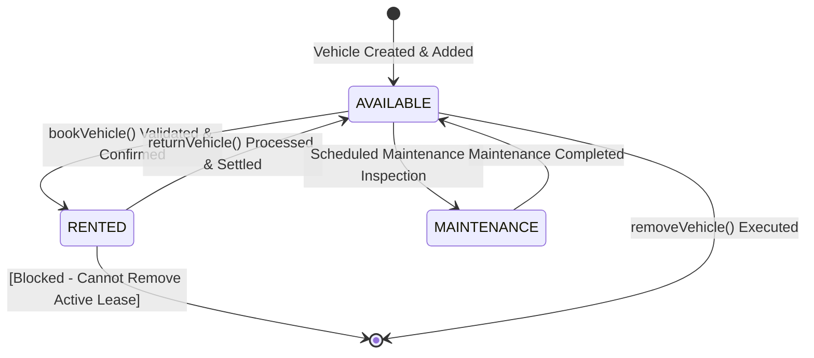
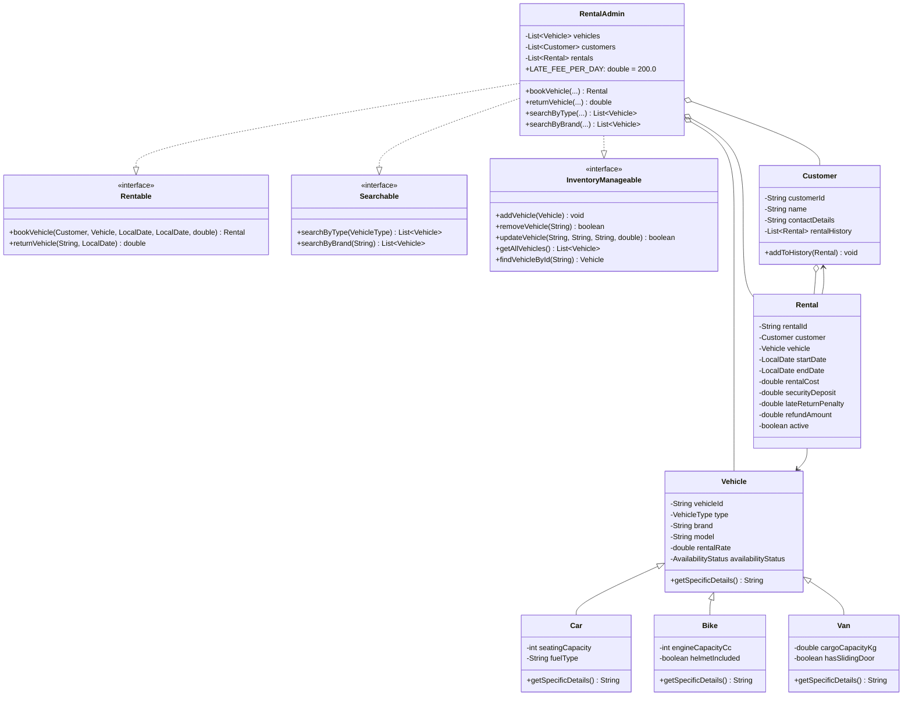
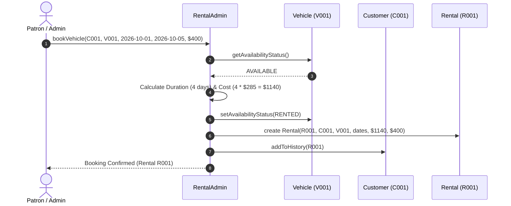
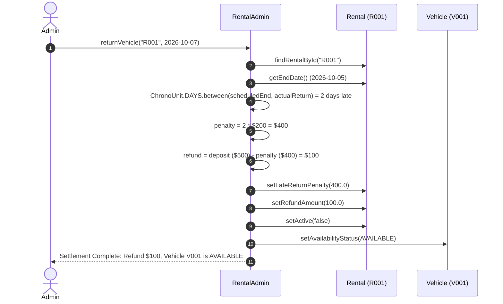

# Vehicle Rental System — Design Document

## 1. Executive Summary & Architecture Overview

The **Vehicle Rental System** is an enterprise-grade, object-oriented application designed to manage vehicle inventory, customer profiles, rental bookings, dynamic financial calculations (rental fees, security deposits), real-time availability tracking, and vehicle return operations (including late-return penalty calculations and deposit refunds).

The architecture adheres to core **Object-Oriented Programming (OOP)** principles:
- **Encapsulation**: Strict access protection with private fields and validated public accessors/mutators.
- **Inheritance & Polymorphism**: A flexible `Vehicle` hierarchy with concrete subclasses (`Car`, `Bike`, `Van`) that override domain behaviors.
- **Abstraction & Interface Segregation**: Distinct behavioral contracts (`Rentable`, `Searchable`, `InventoryManageable`) decoupling "what" the system does from "how" it executes.
- **Real-Time State Tracking**: Deterministic state transitions preventing double-booking and illegal inventory deletions.

---

## 2. Class Design & Specifications

### 2.1 Interface Specifications

#### A. `com.rental.interfaces.Rentable`
Defines the transaction contract for vehicle leases and returns:
- `Rental bookVehicle(Customer customer, Vehicle vehicle, LocalDate startDate, LocalDate endDate, double securityDeposit)`
  - Verifies vehicle availability.
  - Computes rental cost based on day count.
  - Flips vehicle status to `RENTED`.
  - Creates and records the `Rental` record.
- `double returnVehicle(String rentalId, LocalDate actualReturnDate)`
  - Identifies active rental.
  - Calculates late duration (if any) and applies `LATE_FEE_PER_DAY` (₹200/day).
  - Computes deposit refund: $\max(0, \text{Deposit} - \text{Penalty})$.
  - Flips vehicle status back to `AVAILABLE`.
  - Closes rental record and returns refund total.

#### B. `com.rental.interfaces.Searchable`
Defines query operations for available inventory:
- `List<Vehicle> searchByType(VehicleType type)`: Filters available vehicles by category.
- `List<Vehicle> searchByBrand(String brand)`: Case-insensitive brand search for available vehicles.

#### C. `com.rental.interfaces.InventoryManageable`
Defines inventory lifecycle operations:
- `void addVehicle(Vehicle vehicle)`: Inserts a unique vehicle into inventory.
- `boolean removeVehicle(String vehicleId)`: Removes vehicle if not currently rented.
- `boolean updateVehicle(String vehicleId, String newBrand, String newModel, double newRate)`: Updates specifications.
- `List<Vehicle> getAllVehicles()`: Retrieves complete fleet list.
- `Vehicle findVehicleById(String vehicleId)`: Exact ID lookup.

---

### 2.2 Model Classes

#### A. `com.rental.model.Vehicle` (Base Class)
*Attributes:*
- `private String vehicleId`: Unique alphanumeric identifier (e.g. `V001`).
- `private VehicleType type`: Enum (`CAR`, `BIKE`, `VAN`).
- `private String brand`: Manufacturer name (e.g. `Porsche`, `Ducati`).
- `private String model`: Specific model (e.g. `Taycan 4S`, `Panigale V4 S`).
- `private double rentalRate`: Daily cost in currency units.
- `private AvailabilityStatus availabilityStatus`: Current status (`AVAILABLE`, `RENTED`, `MAINTENANCE`).

*Key Methods:*
- Getters and setters for all attributes.
- `public String getSpecificDetails()`: Polymorphic method returning specific attributes.
- `public String toString()`: Formatted string representation.

#### B. Subclasses: `Car`, `Bike`, `Van` (Inheritance & Polymorphism)
- **`Car extends Vehicle`**:
  - Additional attributes: `int seatingCapacity`, `String fuelType` (Electric, Petrol, Hybrid).
  - Overrides `getSpecificDetails()`: returns e.g. `"5 Seats, Electric"`.
- **`Bike extends Vehicle`**:
  - Additional attributes: `int engineCapacityCc`, `boolean helmetIncluded`.
  - Overrides `getSpecificDetails()`: returns e.g. `"1103 cc, Helmet Included"`.
- **`Van extends Vehicle`**:
  - Additional attributes: `double cargoCapacityKg`, `boolean hasSlidingDoor`.
  - Overrides `getSpecificDetails()`: returns e.g. `"Cargo: 1400 kg, Sliding Door"`.

#### C. `com.rental.model.Customer`
*Attributes:*
- `private String customerId`: Unique patron ID (e.g. `C001`).
- `private String name`: Customer full name.
- `private String contactDetails`: Email address or telephone number.
- `private String licenceNumber`: Driving licence number used for identity and rental verification (e.g. `DL-0420180012345`).
- `private List<Rental> rentalHistory`: Chronological audit log of all bookings.

*Key Methods:*
- `public void addToHistory(Rental rental)`: Appends newly confirmed leases.
- `public List<Rental> getRentalHistory()`: Returns full history log.
- `public String getLicenceNumber()` / `setLicenceNumber(String)`: Accessor and mutator for licence verification.

#### D. `com.rental.model.Rental`
*Attributes:*
- `private String rentalId`: Unique lease identifier (e.g. `R001`).
- `private Customer customer`: Associated patron.
- `private Vehicle vehicle`: Associated vehicle.
- `private LocalDate startDate`: Lease inception date.
- `private LocalDate endDate`: Scheduled/expected return date.
- `private double rentalCost`: Pre-computed rental fee based on duration.
- `private double securityDeposit`: Refundable security deposit.
- `private double lateReturnPenalty`: Assessed fine for late drop-off.
- `private double refundAmount`: Net security deposit refund issued upon return.
- `private LocalDate actualReturnDate`: Recorded date of return.
- `private boolean active`: Boolean flag (`true` if currently out on lease).

---

### 2.3 Service & Controller: `com.rental.service.RentalAdmin`
The core business engine orchestrating transactions and state.
- **Interfaces Implemented:** `Rentable`, `Searchable`, `InventoryManageable`.
- **Constants:** `public static final double LATE_FEE_PER_DAY = 200.0;`.
- **Inventory Collections:** `List<Vehicle> vehicles`, `List<Customer> customers`, `List<Rental> rentals`.
- **Real-Time Guard Rails:**
  - Prevents booking any vehicle whose `availabilityStatus != AVAILABLE`.
  - Prevents deleting any vehicle whose `availabilityStatus == RENTED`.
  - Atomically flips status upon confirmation and return.

---

## 3. Real-Time Availability Tracking Lifecycle

1. **At Registration:** When a new vehicle is added, its status defaults to `AVAILABLE`.
2. **On Booking:** As soon as `bookVehicle(...)` passes input validations, `vehicle.setAvailabilityStatus(AvailabilityStatus.RENTED)` is immediately called, preventing any subsequent customer from booking the same vehicle.
3. **On Return:** When `returnVehicle(...)` is called, penalties/refunds are calculated and `vehicle.setAvailabilityStatus(AvailabilityStatus.AVAILABLE)` is restored in real time.

---

## 4. Class Relationship Diagram (UML)

---

## 5. Sequence Diagram: Booking Transaction Flow

---

## 6. Sequence Diagram: Return & Penalty Settlement Flow

